# TalkTracerAI - 🌟 Empowering Productivity Through Meeting Insight. 📈💡

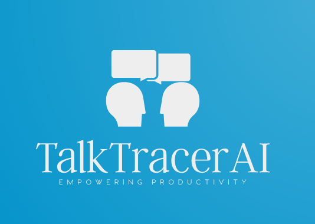

Welcome to TalkTracerAI, an innovative solution aimed at enhancing productivity by providing comprehensive insights from meeting conversations. With TalkTracerAI, gain a deeper understanding of your discussions, extract meaningful information, and unlock valuable data-driven insights from meetings. 🚀🔍

At TalkTracerAI, we take your meeting words and turn them into powerful insights. We help you see what's really going on behind the scenes. It's like having a magic decoder for meetings that shows you the important bits. From knowing how people feel to finding the 'aha!' moments, TalkTracerAI helps you get the most out of every meeting.

With TalkTracerAI, your meetings turn into smart resources that drive better decisions and fuel growth!

  
  
  
  
  
  
  
  
  
  
  

## What is TalkTracerAI? 🌐

TalkTracerAI is an intelligent tool designed to transcribe, analyze, and summarize meeting conversations using cutting-edge Natural Language Processing (NLP) techniques. It empowers users to effortlessly extract key phrases, identify crucial entities, translate discussions into multiple languages, and generate concise summaries, offering a clear and comprehensive view of meeting outcomes. 💬📊

## Key Features: 🎯

- **Transcription:** Seamlessly transcribe audio recordings into textual data for further analysis. 🎤🔤
- **Natural Language Processing (NLP):** Extract key phrases and named entities to derive deeper insights from the conversation content. 🧠📝
- **Translation:** Translate meeting transcripts into various languages, facilitating global collaboration and understanding. 🌎🌐
- **Summarization:** Generate concise summaries to capture the essence of discussions efficiently. 📝✨

## Technologies Used

- **Python 🐍:** Used as the primary programming language for the development of various components, including backend services, data processing, and machine learning implementations.
- **Elasticsearch 🔍:** Utilized to index the text of processed meetings with NLP (Natural Language Processing), enabling precise searches by key terms.
- **Apache Airflow 🛠️:** Implemented to orchestrate the ETL DAG (Directed Acyclic Graph) that processes meetings. This DAG handles transcription, NLP, obtaining summaries of the transcription, translations, and indexing through automated workflows. It uses PostgreSQL as the database engine to store DAG metadata and other necessary information for its proper functioning.
- **Flask 📡:** Chosen as the web microframework to build the backend server and RESTful APIs for TalkTrackerAI, ensuring lightweight and efficient development. HAProxy is used to implement load balancing patterns between multiple MinIO instances and the Flask services of the API.
- **MongoDB 📊:** Used to store and model meetings as BSON documents, providing flexibility in data structure and storage.
- **MinIO 🗄️:** Employed to store meeting audio files, offering high-performance and scalable object storage. HAProxy is also responsible for implementing load balancing patterns for multiple MinIO instances.
- **HAProxy 🔄:** Used both to implement load balancing patterns between multiple MinIO instances and for the Flask services of the TalkTrackerAI API, ensuring system availability and performance.
- **Redis 📦:** Employed as an in-memory data structure store for caching, optimizing data retrieval, and improving system performance.
- **Celery Flower 🌸:** Utilized as a real-time monitoring tool for Celery, providing a web-based user interface to monitor and manage Celery clusters.
- **PostgreSQL 🐘:** Used as the primary relational database for structured data storage and management, ensuring robustness and reliability in Apache Airflow.
- **Fine-Tuned T5 Small for Text Summarization (Hugging Face Model) 🤖:** Leveraged for text summarization tasks, the "t5-small" model, fine-tuned for generating concise and coherent summaries of input text using PyTorch.
- **PyTorch 🧠:** Employed as the deep learning framework to fine-tune the "t5-small" model for text summarization tasks.
- **scikit-learn 🧬:** Utilized for machine learning tasks such as classification, regression, and clustering, offering a wide array of algorithms and tools.
- **spaCy 🛠️:** Employed for advanced NLP tasks such as entity recognition, tokenization, and linguistic annotations, providing a streamlined and efficient framework.
- **vaderSentiment 📈:** Utilized for sentiment analysis tasks, offering a pre-trained model for evaluating the sentiment of text data, especially useful for social media analysis and opinion mining.

## How TalkTracerAI Works: ⚙️

TalkTracerAI leverages state-of-the-art NLP models and cloud-based storage to efficiently process audio recordings, extract crucial information, and deliver insightful summaries. It seamlessly integrates with MongoDB for data storage and retrieval and employs MinIO for cloud-based file storage, ensuring secure and scalable handling of meeting data.

**Empower your meetings with TalkTracerAI and transform the way you derive insights from discussions!** 🌟✨

### Architecture Elements Overview

- **Apache Airflow:** Apache Airflow plays a pivotal role in TalkTracerAI's operation, orchestrating a Directed Acyclic Graph (DAG) that manages the workflow. This DAG automates transcription, NLP analysis, summary generation, translations, and indexing tasks, ensuring a seamless and efficient process flow.
- **Flask:** Flask serves as the backbone of TalkTracerAI's backend infrastructure, providing a lightweight and robust web microframework for constructing the backend server and RESTful APIs. These APIs facilitate interactions between various components, allowing seamless communication and data exchange.
- **Elasticsearch:** Employed for indexing processed meeting text with NLP, Elasticsearch enables precise searches by key terms and significantly enhances data retrieval efficiency.
- **MongoDB:** Utilized to store and model meeting data as BSON documents, MongoDB offers flexibility in data structure and storage, enabling efficient data management and retrieval.
- **MinIO:** MinIO functions as the cloud-based object storage solution for meeting audio files, ensuring high-performance, scalability, and reliability in handling large volumes of data.
- **HAProxy:** HAProxy serves a dual role, implementing load balancing patterns for multiple MinIO instances and managing Flask services of the TalkTracerAI API. This ensures system availability, performance, and effective load distribution.
- **Redis:** Redis acts as an in-memory data structure store, optimizing data retrieval and caching to enhance TalkTracerAI's system performance.
- **Celery Flower:** Celery Flower serves as a real-time monitoring tool for Celery, providing a web-based user interface to monitor and manage Celery clusters, ensuring smooth task queue operations.
- **PostgreSQL:** PostgreSQL functions as the primary relational database for storing structured data in Apache Airflow, guaranteeing robustness and reliability in managing workflow metadata.
- **Hugging Face Model - Fine-Tuned T5 Small for Text Summarization:** Leveraging the "t5-small" model fine-tuned for text summarization tasks using PyTorch, TalkTracerAI generates concise and coherent summaries of meeting transcripts.
- **Other Technologies:** Additional technologies like scikit-learn, spaCy, vaderSentiment, and PyTorch play essential roles in conducting machine learning, NLP tasks, and sentiment analysis, providing a comprehensive and insightful analysis of meeting conversations.

## Tools screenshots

This section provides a visual walkthrough of key components instrumental to the functionality of the project, offering insights and explanations into their roles within the system.

### Apache Airflow

Apache Airflow's web interface grants access to monitor DAG (Directed Acyclic Graph) execution statuses and perform administrative tasks. It serves as a centralized hub for managing workflows efficiently.

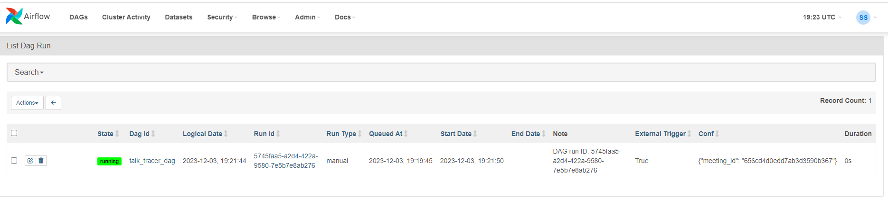
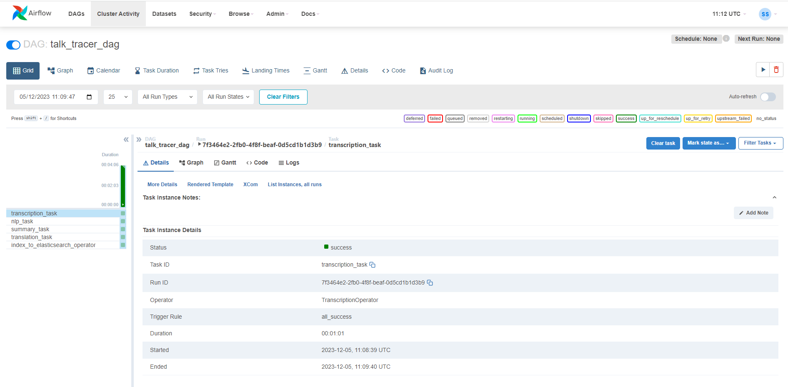
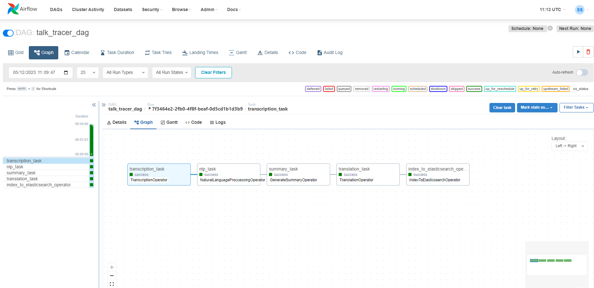
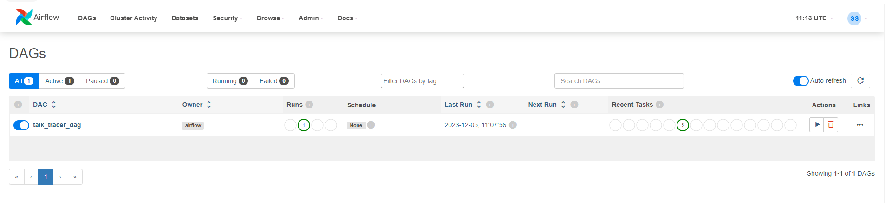

### Celery Flower

Celery Flower is a web-based monitoring tool tailored for overseeing Celery task queues. With its user-friendly interface, it facilitates real-time tracking of task statuses, worker activities, and performance metrics. Celery Flower empowers efficient management of tasks, ensuring seamless operation within Python applications.

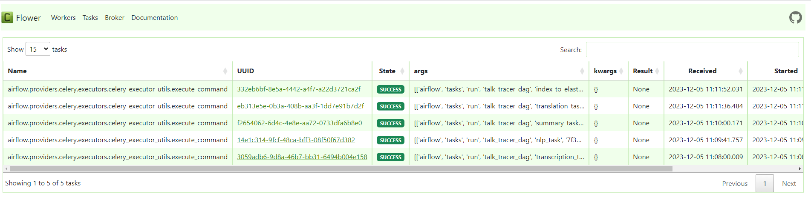
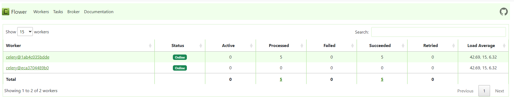

### MongoDB

Configured to capture detailed logs during DAG execution, MongoDB hosts a collection for comprehensive record-keeping. This setup allows for thorough error identification and behavior analysis, overcoming the challenges of inspecting logs within Apache Airflow.

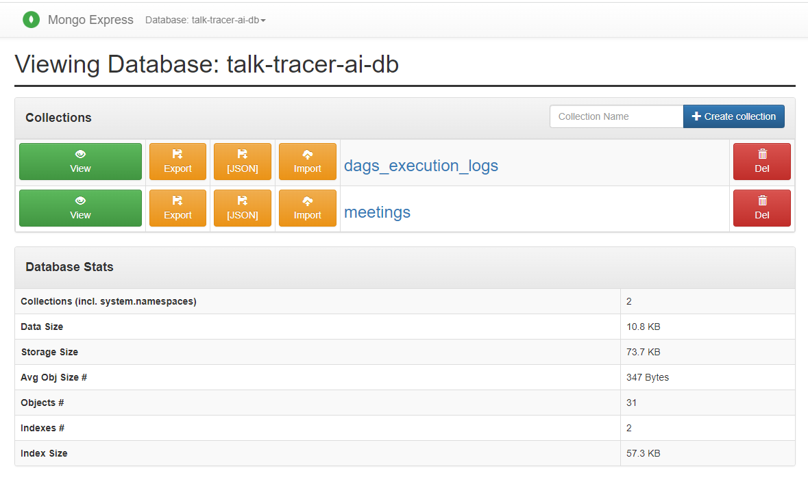

### HAProxy

HAProxy instances manage service replicas and provide web interfaces for monitoring their status. Each HAProxy instance oversees a group of replicas, offering a convenient method to check their operational status, as depicted in the following screenshots.

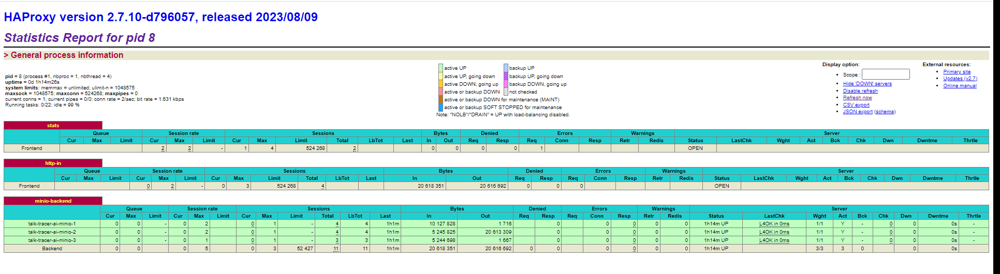
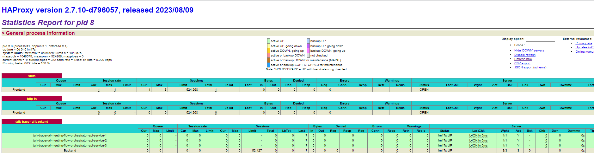

### Docker Compose

The entire project architecture deployment is unified within a single Docker Compose configuration, streamlining the setup and management of the project's infrastructure.

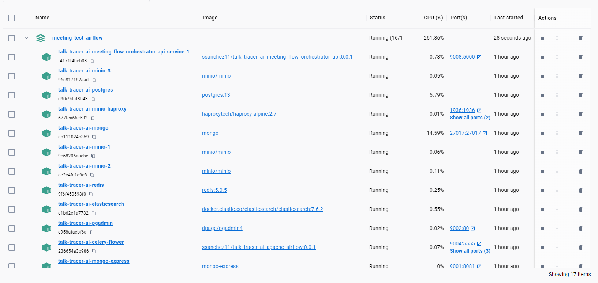

### Postman Collections for TalkTracerAI Meeting Flow Orchestrator

An exclusive Postman collection is available for operating with the TalkTracerAI Meeting Flow Orchestrator service. This collection facilitates various functionalities, including:

- Uploading audio files along with metadata for meeting analysis.
- Querying generated meetings.
- Conducting specific term-based searches within meetings.
- Deleting analyzed meetings from the system.
- 
This dedicated Postman collection simplifies interaction with the TalkTracerAI Meeting Flow Orchestrator service, enabling seamless execution of diverse operations for meeting analysis and management.

## Task Descriptions

The following table provides descriptions and examples of tasks available in the Rakefile for deploying and managing your environment.

| Rake Task                                           | Purpose                                                                                                          |
|-----------------------------------------------------|------------------------------------------------------------------------------------------------------------------|
| `talktracerai:deploy`                               | Deploys the architecture and starts all necessary services and daemons for proper functionality.                |
| `talktracerai:undeploy`                             | Undeploys the architecture.                                                                                       |
| `talktracerai:start`                                | Starts the containers.                                                                                            |
| `talktracerai:stop`                                 | Stops the containers.                                                                                             |
| `talktracerai:status`                               | Displays the status of the containers.                                                                            |
| `talktracerai:create_apache_airflow_users`           | Creates users in Apache Airflow.                                                                                  |
| `talktracerai:build_and_push_airflow_image`          | Builds and pushes the Apache Airflow Docker image to DockerHub.                                                   |
| `talktracerai:build_and_push_meeting_flow_orchestrator_api_image` | Builds and pushes the TalkTracerAI MeetingFlow Orchestrator API Docker image to DockerHub.    |
| `talktracerai:clean_environment`                     | Cleans the environment by removing Docker images and volumes.                                                      |
| `talktracerai:check_docker`                         | Checks the presence and accessibility of Docker and Docker Compose in the specified path.                         |
| `talktracerai:login`                                | Authenticates with existing Docker credentials.                                                                    |
| `talktracerai:check_deployment_file`                 | Checks the existence of the deployment file "docker-compose.yml".                                                 |

## Services and Ports Configuration

The following Docker Compose configuration defines various services required for the Talk Tracer AI platform. Each service encapsulates a specific functionality within the system and is orchestrated to work together within a unified environment. These services encompass diverse components such as databases, message brokers, API services, orchestration tools, and more.

This section outlines the services along with their corresponding ports explicitly defined for communication or accessibility. Ports play a vital role in establishing communication channels between different services or enabling external access to specific functionalities within the Talk Tracer AI ecosystem.

Understanding the designated services and their associated ports is crucial for comprehending how different components interact and ensuring proper configuration for seamless operation and external interaction with the platform.

| Service                                         | Port(s)                                              |
|--------------------------------------------------|------------------------------------------------------|
| talk_tracer_ai_elasticsearch                     | -                                                    |
| talk_tracer_ai_minio1                            | -                                                    |
| talk_tracer_ai_minio2                            | -                                                    |
| talk_tracer_ai_minio3                            | -                                                    |
| talk_tracer_ai_haproxy                           | 9000, 1936                                          |
| talk_tracer_ai_mongo                             | 27017                                                |
| talk_tracer_ai_mongo_express                     | 9001                                                 |
| talk_tracer_ai_redis                             | -                                                    |
| talk_tracer_ai_postgres                          | 5432                                                 |
| talk_tracer_ai_pgadmin                           | 9002                                                 |
| talk_tracer_ai_airflow_webserver                 | 9003                                                 |
| talk_tracer_ai_celery_flower                     | 9004, 9005, 9006                                     |
| talk_tracer_ai_airflow_scheduler                  | 9007                                                 |
| talk_tracer_ai_airflow_worker_1                  | -                                                    |
| talk_tracer_ai_airflow_worker_2                  | -                                                    |
| talk_tracer_ai_meeting_flow_orchestrator_api_1    | -                                                    |
| talk_tracer_ai_meeting_flow_orchestrator_api_2    | -                                                    |
| talk_tracer_ai_meeting_flow_orchestrator_api_3    | -                                                    |
| talk_tracer_ai_meeting_flow_orchestrator_haproxy | 9008, 1937                                           |

## Contribution
Contributions to TalkTracerAI are highly encouraged! If you're interested in adding new features, resolving bugs, or enhancing the project's functionality, please feel free to submit pull requests.

## License
This project is licensed under the [MIT License](LICENSE).

## Credits

TalkTracerAI is developed and maintained by **Sergio Sánchez Sánchez** (Dream Software). Special thanks to the open-source community and the contributors who have made this project possible.
If you have any questions, feedback, or suggestions, feel free to reach out at dreamsoftware92@gmail.com.

