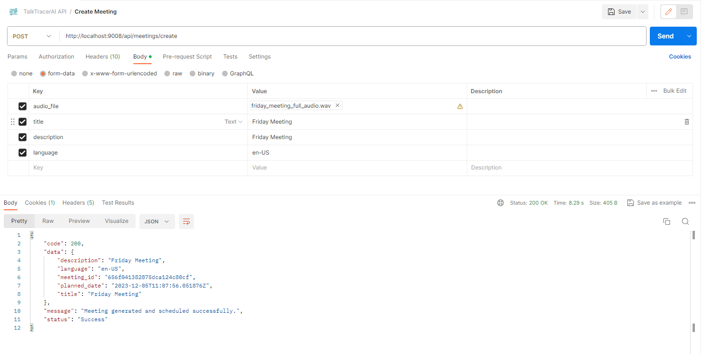
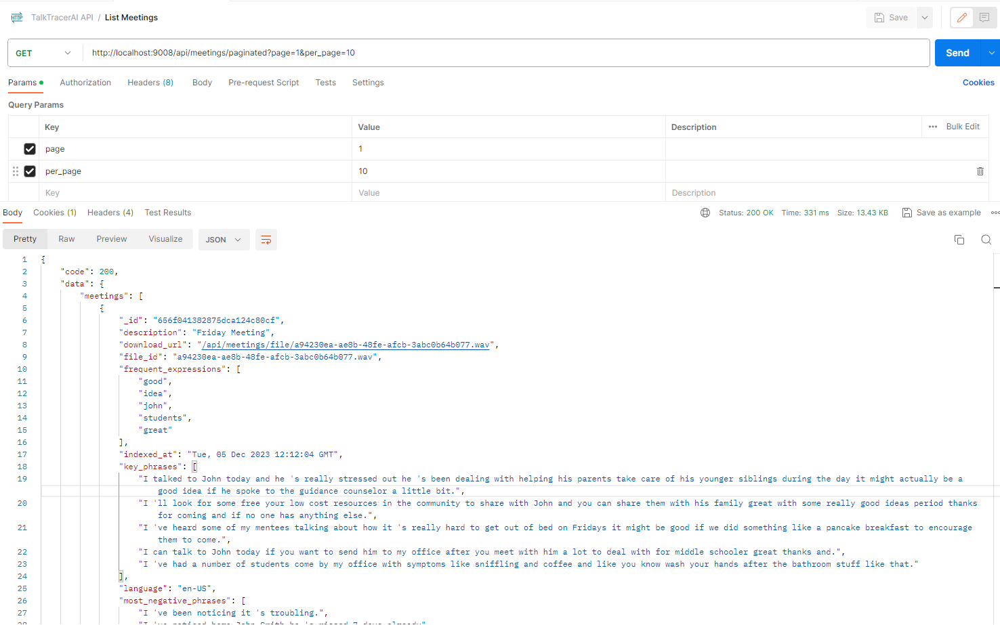

# TalkTracerAI - 🌟 Empowering Productivity Through Meeting Insight. 📈💡


Welcome to TalkTracerAI, an innovative solution aimed at enhancing productivity by providing comprehensive insights from meeting conversations. With TalkTracerAI, gain a deeper understanding of your discussions, extract meaningful information, and unlock valuable data-driven insights from meetings. 🚀🔍

At TalkTracerAI, we take your meeting words and turn them into powerful insights. We help you see what's really going on behind the scenes. It's like having a magic decoder for meetings that shows you the important bits. From knowing how people feel to finding the 'aha!' moments, TalkTracerAI helps you get the most out of every meeting.

With TalkTracerAI, your meetings turn into smart resources that drive better decisions and fuel growth!

<p align="center">
  
  
  
  
  
  
  
  
  
  
  
</p>

## What is TalkTracerAI? 🌐

TalkTracerAI is an intelligent tool designed to transcribe, analyze, and summarize meeting conversations using cutting-edge Natural Language Processing (NLP) techniques. It empowers users to effortlessly extract key phrases, identify crucial entities, translate discussions into multiple languages, and generate concise summaries, offering a clear and comprehensive view of meeting outcomes. 💬📊

## ⚠️ Disclaimer  

**TalkTracerAI** is an **educational project** designed to explore Natural Language Processing (NLP) techniques for meeting analysis. This tool is intended for **learning and research purposes**.  

The **logo and project name** were generated during a brainstorming session with AI, and any resemblance to existing names or brands is purely coincidental.  

## More Details 📝

For comprehensive information about this project, check out this [Medium article](https://medium.com/@sanchezsanchezsergio418/revolutionizing-workplace-productivity-with-ai-driven-meeting-insights-d3b2a4cf27a4).

## Key Features: 🎯

- **Transcription:** Seamlessly transcribe audio recordings into textual data for further analysis. 🎤🔤
- **Natural Language Processing (NLP):** Extract key phrases and named entities to derive deeper insights from the conversation content. 🧠📝
- **Translation:** Translate meeting transcripts into various languages, facilitating global collaboration and understanding. 🌎🌐
- **Summarization:** Generate concise summaries to capture the essence of discussions efficiently. 📝✨

## Technologies Used

- **Python 🐍:** Used as the primary programming language for the development of various components, including backend services, data processing, and machine learning implementations.
- **Elasticsearch 🔍:** Utilized to index the text of processed meetings with NLP (Natural Language Processing), enabling precise searches by key terms.
- **Apache Airflow 🛠️:** Implemented to orchestrate the ETL DAG (Directed Acyclic Graph) that processes meetings. This DAG handles transcription, NLP, obtaining summaries of the transcription, translations, and indexing through automated workflows. It uses PostgreSQL as the database engine to store DAG metadata and other necessary information for its proper functioning.
- **Flask 📡:** Chosen as the web microframework to build the backend server and RESTful APIs for TalkTrackerAI, ensuring lightweight and efficient development. HAProxy is used to implement load balancing patterns between multiple MinIO instances and the Flask services of the API.
- **MongoDB 📊:** Used to store and model meetings as BSON documents, providing flexibility in data structure and storage.
- **MinIO 🗄️:** Employed to store meeting audio files, offering high-performance and scalable object storage. HAProxy is also responsible for implementing load balancing patterns for multiple MinIO instances.
- **HAProxy 🔄:** Used both to implement load balancing patterns between multiple MinIO instances and for the Flask services of the TalkTrackerAI API, ensuring system availability and performance.
- **Redis 📦:** Employed as an in-memory data structure store for caching, optimizing data retrieval, and improving system performance.
- **Celery Flower 🌸:** Utilized as a real-time monitoring tool for Celery, providing a web-based user interface to monitor and manage Celery clusters.
- **PostgreSQL 🐘:** Used as the primary relational database for structured data storage and management, ensuring robustness and reliability in Apache Airflow.
- **Fine-Tuned T5 Small for Text Summarization (Hugging Face Model) 🤖:** Leveraged for text summarization tasks, the "t5-small" model, fine-tuned for generating concise and coherent summaries of input text using PyTorch.
- **PyTorch 🧠:** Employed as the deep learning framework to fine-tune the "t5-small" model for text summarization tasks.
- **scikit-learn 🧬:** Utilized for machine learning tasks such as classification, regression, and clustering, offering a wide array of algorithms and tools.
- **spaCy 🛠️:** Employed for advanced NLP tasks such as entity recognition, tokenization, and linguistic annotations, providing a streamlined and efficient framework.
- **vaderSentiment 📈:** Utilized for sentiment analysis tasks, offering a pre-trained model for evaluating the sentiment of text data, especially useful for social media analysis and opinion mining.

## How TalkTracerAI Works: ⚙️

TalkTracerAI leverages state-of-the-art NLP models and cloud-based storage to efficiently process audio recordings, extract crucial information, and deliver insightful summaries. It seamlessly integrates with MongoDB for data storage and retrieval and employs MinIO for cloud-based file storage, ensuring secure and scalable handling of meeting data.


**Empower your meetings with TalkTracerAI and transform the way you derive insights from discussions!** 🌟✨

### Architecture Elements Overview

- **Apache Airflow:** Apache Airflow plays a pivotal role in TalkTracerAI's operation, orchestrating a Directed Acyclic Graph (DAG) that manages the workflow. This DAG automates transcription, NLP analysis, summary generation, translations, and indexing tasks, ensuring a seamless and efficient process flow.
- **Flask:** Flask serves as the backbone of TalkTracerAI's backend infrastructure, providing a lightweight and robust web microframework for constructing the backend server and RESTful APIs. These APIs facilitate interactions between various components, allowing seamless communication and data exchange.
- **Elasticsearch:** Employed for indexing processed meeting text with NLP, Elasticsearch enables precise searches by key terms and significantly enhances data retrieval efficiency.
- **MongoDB:** Utilized to store and model meeting data as BSON documents, MongoDB offers flexibility in data structure and storage, enabling efficient data management and retrieval.
- **MinIO:** MinIO functions as the cloud-based object storage solution for meeting audio files, ensuring high-performance, scalability, and reliability in handling large volumes of data.
- **HAProxy:** HAProxy serves a dual role, implementing load balancing patterns for multiple MinIO instances and managing Flask services of the TalkTracerAI API. This ensures system availability, performance, and effective load distribution.
- **Redis:** Redis acts as an in-memory data structure store, optimizing data retrieval and caching to enhance TalkTracerAI's system performance.
- **Celery Flower:** Celery Flower serves as a real-time monitoring tool for Celery, providing a web-based user interface to monitor and manage Celery clusters, ensuring smooth task queue operations.
- **PostgreSQL:** PostgreSQL functions as the primary relational database for storing structured data in Apache Airflow, guaranteeing robustness and reliability in managing workflow metadata.
- **Hugging Face Model - Fine-Tuned T5 Small for Text Summarization:** Leveraging the "t5-small" model fine-tuned for text summarization tasks using PyTorch, TalkTracerAI generates concise and coherent summaries of meeting transcripts.
- **Other Technologies:** Additional technologies like scikit-learn, spaCy, vaderSentiment, and PyTorch play essential roles in conducting machine learning, NLP tasks, and sentiment analysis, providing a comprehensive and insightful analysis of meeting conversations.

## Practical Examples: Meetings Transformed into Valuable Insights
Welcome to the showcase of TalkTracerAI in action! In this section, we present real-life samples of meetings processed by our system and the resulting outcomes. Dive into these practical examples to witness how conversations turn into valuable information that drives decision-making.

Each example serves as a window into how TalkTracerAI extracts meaningful data from meetings. From accurate transcriptions to detailed summaries and translations into various languages, these examples illustrate how TalkTracerAI transforms meeting content into actionable insights.

Explore these instances and discover how TalkTracerAI can turn any conversation into valuable information for your team!

### Friday Meeting

[friday_meeting_full_audio](doc/examples/friday_meeting_full_audio.wav)


```
{
    _id: ObjectId('656f041382875dca124c80cf'),
    title: 'Friday Meeting',
    description: 'Friday Meeting',
    language: 'en-US',
    file_id: 'a94230ea-ae8b-48fe-afcb-3abc0b64b077.wav',
    timestamp: ISODate('2023-12-05T11:05:55.782Z'),
    planned: true,
    planned_date: '2023-12-05T11:07:56.051876Z',
    transcribed_text: 'hello everyone thank you guys for coming to our weekly Student Success meeting and let \'s just get started so. I have a list of chronically absent students here and. I \'ve been noticing it \'s troubling. Trend a lot of students are skipping on Fridays does anyone have any idea what \'s going on. I \'ve heard some of my mentees talking about how it \'s really hard to get out of bed on Fridays it might be good if we did something like a pancake breakfast to encourage them to come. I think that \'s a great idea because a lot of students have been getting sick now that it \'s getting colder outside. I \'ve had a number of students come by my office with symptoms like sniffling and coffee and like you know wash your hands after the bathroom stuff like that. I think that \'s a good idea and it \'ll be a good reminder for the teachers as well one of the things. I wanted to talk about there \'s a student. I \'ve noticed here John Smith he \'s missed 7 days already and it \'s only November does anyone have an idea what \'s going on with him. I might be able to fill in the gaps there. I talked to John today and he \'s really stressed out he \'s been dealing with helping his parents take care of his younger siblings during the day it might actually be a good idea if he spoke to the guidance counselor a little bit. I can talk to John today if you want to send him to my office after you meet with him a lot to deal with for middle schooler great thanks and. I can help out with the family child care near me. I \'ll look for some free your low cost resources in the community to share with John and you can share them with his family great with some really good ideas period thanks for coming and if no one has anything else. I think we can wrap up',
    frequent_expressions: [
        'good',
        'idea',
        'john',
        'students',
        'great'
    ],
    key_phrases: [
        'I talked to John today and he \'s really stressed out he \'s been dealing with helping his parents take care of his younger siblings during the day it might actually be a good idea if he spoke to the guidance counselor a little bit.',
        'I \'ll look for some free your low cost resources in the community to share with John and you can share them with his family great with some really good ideas period thanks for coming and if no one has anything else.',
        'I \'ve heard some of my mentees talking about how it \'s really hard to get out of bed on Fridays it might be good if we did something like a pancake breakfast to encourage them to come.',
        'I can talk to John today if you want to send him to my office after you meet with him a lot to deal with for middle schooler great thanks and.',
        'I \'ve had a number of students come by my office with symptoms like sniffling and coffee and like you know wash your hands after the bathroom stuff like that.'
    ],
    most_negative_phrases: [
        'I \'ve been noticing it \'s troubling.',
        'I \'ve noticed here John Smith he \'s missed 7 days already',
        'I wanted to talk about there \'s a student.'
    ],
    most_positive_phrases: [
        'I \'ve heard some of my mentees talking about how it \'s really hard to get out of bed on Fridays it might be good if we did something like a pancake breakfast to encourage them to come.',
        'I can talk to John today if you want to send him to my office after you meet with him a lot to deal with for middle schooler great thanks and.',
        'I \'ll look for some free your low cost resources in the community to share with John and you can share them with his family great with some really good ideas period thanks for coming and if no one has anything else.'
    ],
    named_entities: [
        {
            text: 'weekly',
            start_char: 48,
            end_char: 54,
            label: 'DATE'
        },
        {
            text: 'Student Success',
            start_char: 55,
            end_char: 70,
            label: 'ORG'
        },
        {
            text: 'Fridays',
            start_char: 243,
            end_char: 250,
            label: 'DATE'
        },
        {
            text: 'Fridays',
            start_char: 383,
            end_char: 390,
            label: 'DATE'
        },
        {
            text: 'John Smith',
            start_char: 920,
            end_char: 930,
            label: 'PERSON'
        },
        {
            text: '7 days',
            start_char: 944,
            end_char: 950,
            label: 'DATE'
        },
        {
            text: 'only November',
            start_char: 969,
            end_char: 982,
            label: 'DATE'
        },
        {
            text: 'John',
            start_char: 1090,
            end_char: 1094,
            label: 'PERSON'
        },
        {
            text: 'today',
            start_char: 1095,
            end_char: 1100,
            label: 'DATE'
        },
        {
            text: 'the day',
            start_char: 1216,
            end_char: 1223,
            label: 'DATE'
        },
        {
            text: 'John',
            start_char: 1323,
            end_char: 1327,
            label: 'PERSON'
        },
        {
            text: 'today',
            start_char: 1328,
            end_char: 1333,
            label: 'DATE'
        },
        {
            text: 'John',
            start_char: 1583,
            end_char: 1587,
            label: 'PERSON'
        }
    ],
    summary: 'I \'ve had a number of students come by my office with symptoms like sniffling and coffee and like you know wash your hands after the bathroom stuff like that . I wanted to talk about there \'s a student. I\'ve noticed here John Smith he missed 7 days already . It\'s only November does anyone have an idea what\'s going on with him. I might be able to fill in the gaps there. I can talk to John today if you want to send him to my office after you meet',
    summary_translations: {
        'es-ES': 'Hice que varios estudiantes pasen por mi oficina con síntomas como oler y café y, como si sepas, te laves las manos después de las cosas del baño como esa.Quería hablar de que hay un estudiante.He notado que aquí John Smith ya se perdió 7 días.Es solo en noviembre, ¿alguien tiene una idea de lo que está pasando con él?Podría llenar los vacíos allí.Puedo hablar con John hoy si quieres enviarlo a mi oficina después de conocer',
        'fr-FR': 'J\'ai eu un certain nombre d\'étudiants venus par mon bureau avec des symptômes comme le reniflement et le café et comme vous le savez, lavez-vous les mains après les trucs de salle de bain comme ça.Je voulais parler de là, c\'est un étudiant.J\'ai remarqué ici John Smith qu\'il avait déjà raté 7 jours.Ce n\'est que novembre que quelqu\'un a une idée de ce qui se passe avec lui.Je pourrais peut-être combler les lacunes là-bas.Je peux parler à John aujourd\'hui si vous voulez l\'envoyer à mon bureau après votre rencontre',
        'de-DE': 'Ich hatte eine Reihe von Schülern in meinem Büro mit Symptomen wie Schnüffeln und Kaffee und wie Sie wissen, dass Sie sich nach dem Badezimmer Ihre Hände waschen.Ich wollte darüber sprechen, dass ein Student ist.Ich habe hier John Smith bemerkt, dass er bereits 7 Tage verpasst hat.Es ist nur November. Hat jemand eine Idee, was mit ihm los ist.Vielleicht kann ich die Lücken dort füllen.Ich kann heute mit John sprechen, wenn Sie ihn nach dem Treffen in mein Büro schicken möchten'
    },
    transcription_translations: {
        'es-ES': 'Hola a todos, gracias a ustedes por venir a nuestra reunión semanal de éxito estudiantil y vamos a comenzar así.Tengo una lista de estudiantes crónicamente ausentes aquí y.He estado notando que es preocupante.Tendencia que muchos estudiantes se saltan los viernes ¿Alguien tiene alguna idea de lo que está pasando?He escuchado a algunos de mis aprendices hablar sobre cómo es realmente difícil levantarse de la cama los viernes, podría ser bueno si hiciéramos algo como un desayuno de panqueques para alentarlos a que vengan.Creo que es una gran idea porque muchos estudiantes se han enfermado ahora que se está haciendo más frío afuera.Hice que varios estudiantes pasen por mi oficina con síntomas como oler y café y, como si sepas, te laves las manos después de las cosas del baño como esa.Creo que es una buena idea y será un buen recordatorio para los maestros también una de las cosas.Quería hablar de que hay un estudiante.He notado que aquí John Smith ya ha perdido 7 días y es solo noviembre, ¿alguien tiene una idea de lo que está pasando con él?Podría llenar los vacíos allí.Hablé con John hoy y él está realmente estresado que ha estado lidiando con ayudar a sus padres a cuidar a sus hermanos menores durante el día, en realidad podría ser una buena idea si hablara un poco con el consejero.Puedo hablar con John hoy si quieres enviarlo a mi oficina después de reunirte mucho con él con el que lidiar para un gran estudiante de secundaria, gracias y.Puedo ayudar con el cuidado de niños familiares cerca de mí.Buscaré algunos recursos de bajo costo en la comunidad para compartir con John y podrá compartirlos con su familia muy bien con un período de ideas realmente buenas gracias por venir y si nadie tiene nada más.Creo que podemos concluir',
        'fr-FR': 'Bonjour à tous, merci les gars d\'être venus à notre réunion hebdomadaire de réussite des étudiants et de commencer ainsi.J\'ai une liste d\'étudiants absents chroniquement ici et.J\'ai remarqué que c\'est troublant.Tendance Beaucoup d\'étudiants sautent le vendredi. Quelqu\'un a-t-il une idée de ce qui se passe.J\'ai entendu certains de mes mentorés parler de la façon dont il est vraiment difficile de sortir du lit le vendredi.Je pense que c\'est une excellente idée parce que beaucoup d\'étudiants sont tombés malades maintenant que ça fait plus froid dehors.J\'ai eu un certain nombre d\'étudiants venus par mon bureau avec des symptômes comme le reniflement et le café et comme vous le savez, lavez-vous les mains après les trucs de salle de bain comme ça.Je pense que c\'est une bonne idée et ce sera un bon rappel pour les enseignants ainsi que l\'une des choses.Je voulais parler de là, c\'est un étudiant.J\'ai remarqué ici que John Smith a déjà raté 7 jours et ce n\'est que novembre que quelqu\'un a une idée de ce qui se passe avec lui.Je pourrais peut-être combler les lacunes là-bas.J\'ai parlé à John aujourd\'hui et il a vraiment souligné qu\'il avait affaire à aider ses parents à s\'occuper de ses frères et sœurs plus jeunes pendant la journée, cela pourrait être une bonne idée s\'il parlait un peu du conseiller d\'orientation.Je peux parler à John aujourd\'hui si vous voulez l\'envoyer à mon bureau après l\'avoir beaucoup rencontré pour faire face à l\'école intermédiaire super merci et.Je peux aider avec les services de garde en famille près de chez moi.Je chercherai gratuitement vos ressources à faible coût dans la communauté pour partager avec John et vous pourrez les partager avec sa famille très bien avec de très bonnes idées, merci d\'être venue et si personne n\'a rien d\'autre.Je pense que nous pouvons conclure',
        'de-DE': 'Hallo allerseits, danke euch, dass du zu unserem wöchentlichen Treffen für Studentenerfolg gekommen bist, und lass uns einfach so anfangen.Ich habe eine Liste chronisch abwesender Schüler hier und.Ich habe bemerkt, dass es beunruhigend ist.Trend viele Studenten überspringen freitags. Hat jemand eine Ahnung, was los ist.Ich habe einige meiner Mentees darüber gesprochen, wie es wirklich schwierig ist, freitags aus dem Bett zu kommen. Es könnte gut sein, wenn wir so etwas wie ein Pfannkuchenfrühstück tun, um sie zu ermutigen, zu kommen.Ich denke, das ist eine großartige Idee, weil viele Studenten jetzt krank wurden, da es draußen kälter wird.Ich hatte eine Reihe von Schülern in meinem Büro mit Symptomen wie Schnüffeln und Kaffee und wie Sie wissen, dass Sie sich nach dem Badezimmer Ihre Hände waschen.Ich denke, das ist eine gute Idee und es wird eine gute Erinnerung für die Lehrer auch eines der Dinge sein.Ich wollte darüber sprechen, dass ein Student ist.Ich habe hier bemerkt, dass John Smith bereits 7 Tage verpasst hat und es nur November hat eine Idee, was mit ihm los ist.Vielleicht kann ich die Lücken dort füllen.Ich habe heute mit John gesprochen und er hat sich wirklich gestresst, dass er es zu tun hat, seinen Eltern zu helfen, sich um seine jüngeren Geschwister zu kümmern, tagsüber könnte es tatsächlich eine gute Idee sein, wenn er ein wenig mit dem Berater der Berater sprach.Ich kann heute mit John sprechen, wenn Sie ihn in mein Büro schicken möchten, nachdem Sie sich viel mit ihm getroffen haben, um sich für den Mittelschüler zu befassen.Ich kann mit der Kinderbetreuung der Familie in meiner Nähe helfen.Ich suche nach einer kostenlosen kostenlosen Ressourcen in der Community, um sie mit John zu teilen, und Sie können sie mit seiner Familie mit einiger wirklich guter Ideenzeiten teilen. Danke für das Kommen und wenn niemand etwas anderes hat.Ich denke, wir können abschließen'
    },
    indexed_at: ISODate('2023-12-05T12:12:04.837Z')
}
```


## Tools screenshots

This section provides a visual walkthrough of key components instrumental to the functionality of the project, offering insights and explanations into their roles within the system.

### Apache Airflow

Apache Airflow's web interface grants access to monitor DAG (Directed Acyclic Graph) execution statuses and perform administrative tasks. It serves as a centralized hub for managing workflows efficiently.


### Celery Flower

Celery Flower is a web-based monitoring tool tailored for overseeing Celery task queues. With its user-friendly interface, it facilitates real-time tracking of task statuses, worker activities, and performance metrics. Celery Flower empowers efficient management of tasks, ensuring seamless operation within Python applications.


### MongoDB

Configured to capture detailed logs during DAG execution, MongoDB hosts a collection for comprehensive record-keeping. This setup allows for thorough error identification and behavior analysis, overcoming the challenges of inspecting logs within Apache Airflow.


### HAProxy

HAProxy instances manage service replicas and provide web interfaces for monitoring their status. Each HAProxy instance oversees a group of replicas, offering a convenient method to check their operational status, as depicted in the following screenshots.


### Docker Compose

The entire project architecture deployment is unified within a single Docker Compose configuration, streamlining the setup and management of the project's infrastructure.


### Postman Collections for TalkTracerAI Meeting Flow Orchestrator

An exclusive Postman collection is available for operating with the TalkTracerAI Meeting Flow Orchestrator service. This collection facilitates various functionalities, including:

- Uploading audio files along with metadata for meeting analysis.
- Querying generated meetings.
- Conducting specific term-based searches within meetings.
- Deleting analyzed meetings from the system.



  
This dedicated Postman collection simplifies interaction with the TalkTracerAI Meeting Flow Orchestrator service, enabling seamless execution of diverse operations for meeting analysis and management.

## Task Descriptions

The following table provides descriptions and examples of tasks available in the Rakefile for deploying and managing your environment.

| Rake Task                                           | Purpose                                                                                                          |
|-----------------------------------------------------|------------------------------------------------------------------------------------------------------------------|
| `talktracerai:deploy`                               | Deploys the architecture and starts all necessary services and daemons for proper functionality.                |
| `talktracerai:undeploy`                             | Undeploys the architecture.                                                                                       |
| `talktracerai:start`                                | Starts the containers.                                                                                            |
| `talktracerai:stop`                                 | Stops the containers.                                                                                             |
| `talktracerai:status`                               | Displays the status of the containers.                                                                            |
| `talktracerai:create_apache_airflow_users`           | Creates users in Apache Airflow.                                                                                  |
| `talktracerai:build_and_push_airflow_image`          | Builds and pushes the Apache Airflow Docker image to DockerHub.                                                   |
| `talktracerai:build_and_push_meeting_flow_orchestrator_api_image` | Builds and pushes the TalkTracerAI MeetingFlow Orchestrator API Docker image to DockerHub.    |
| `talktracerai:clean_environment`                     | Cleans the environment by removing Docker images and volumes.                                                      |
| `talktracerai:check_docker`                         | Checks the presence and accessibility of Docker and Docker Compose in the specified path.                         |
| `talktracerai:login`                                | Authenticates with existing Docker credentials.                                                                    |
| `talktracerai:check_deployment_file`                 | Checks the existence of the deployment file "docker-compose.yml".                                                 |


## Services and Ports Configuration

The following Docker Compose configuration defines various services required for the Talk Tracer AI platform. Each service encapsulates a specific functionality within the system and is orchestrated to work together within a unified environment. These services encompass diverse components such as databases, message brokers, API services, orchestration tools, and more.

This section outlines the services along with their corresponding ports explicitly defined for communication or accessibility. Ports play a vital role in establishing communication channels between different services or enabling external access to specific functionalities within the Talk Tracer AI ecosystem.

Understanding the designated services and their associated ports is crucial for comprehending how different components interact and ensuring proper configuration for seamless operation and external interaction with the platform.

| Service                                         | Port(s)                                              |
|--------------------------------------------------|------------------------------------------------------|
| talk_tracer_ai_elasticsearch                     | -                                                    |
| talk_tracer_ai_minio1                            | -                                                    |
| talk_tracer_ai_minio2                            | -                                                    |
| talk_tracer_ai_minio3                            | -                                                    |
| talk_tracer_ai_haproxy                           | 9000, 1936                                          |
| talk_tracer_ai_mongo                             | 27017                                                |
| talk_tracer_ai_mongo_express                     | 9001                                                 |
| talk_tracer_ai_redis                             | -                                                    |
| talk_tracer_ai_postgres                          | 5432                                                 |
| talk_tracer_ai_pgadmin                           | 9002                                                 |
| talk_tracer_ai_airflow_webserver                 | 9003                                                 |
| talk_tracer_ai_celery_flower                     | 9004, 9005, 9006                                     |
| talk_tracer_ai_airflow_scheduler                  | 9007                                                 |
| talk_tracer_ai_airflow_worker_1                  | -                                                    |
| talk_tracer_ai_airflow_worker_2                  | -                                                    |
| talk_tracer_ai_meeting_flow_orchestrator_api_1    | -                                                    |
| talk_tracer_ai_meeting_flow_orchestrator_api_2    | -                                                    |
| talk_tracer_ai_meeting_flow_orchestrator_api_3    | -                                                    |
| talk_tracer_ai_meeting_flow_orchestrator_haproxy | 9008, 1937                                           |

## Contribution
Contributions to TalkTracerAI are highly encouraged! If you're interested in adding new features, resolving bugs, or enhancing the project's functionality, please feel free to submit pull requests.

## License
This project is licensed under the [MIT License](LICENSE).

## Credits

TalkTracerAI is developed and maintained by **Sergio Sánchez Sánchez** (Dream Software). Special thanks to the open-source community and the contributors who have made this project possible.
If you have any questions, feedback, or suggestions, feel free to reach out at dreamsoftware92@gmail.com.

## Visitors Count


## Please Share & Star the repository to keep me motivated.
  
  <a href = "https://github.com/sergio11/talk_tracer_ai_architecture/stargazers">

